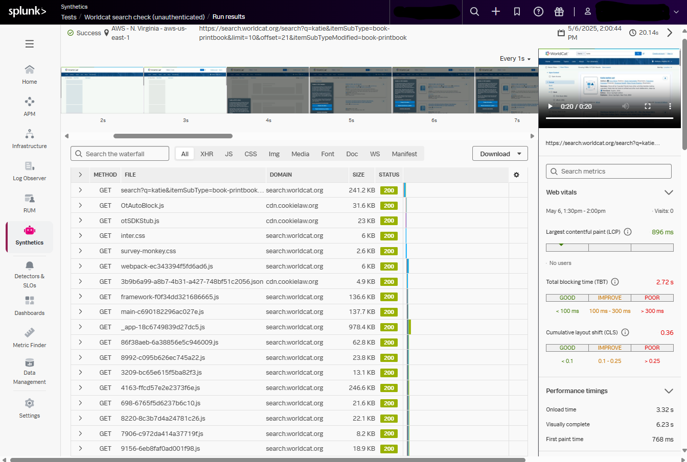
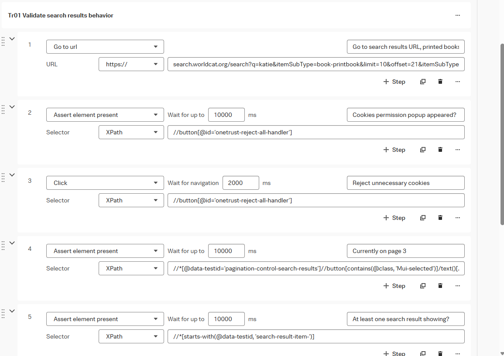
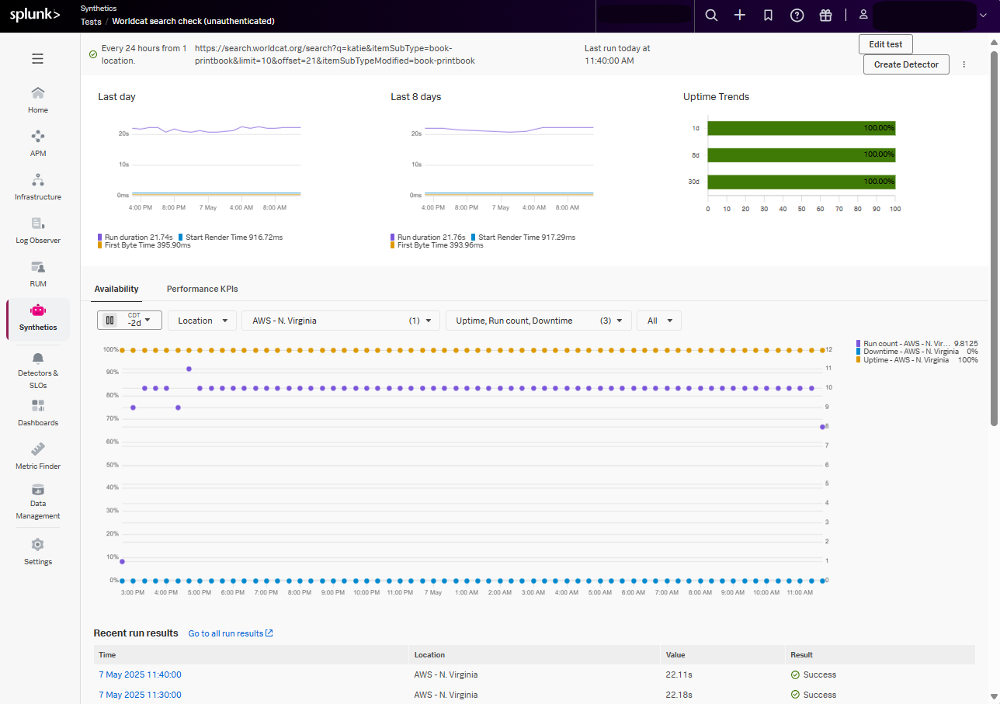

# Synthetic testing with Splunk Observability Cloud

I made my first browser test with Splunk Synthetic Monitoring.

It searches the "Worldcat" catalog of books, videos, music, etc. available at libraries around the world.

## Steps

1. Search `https://search.worldcat.org/search` for the word "`Katie`," filtered down to "`Print Book`" format only, and jumped page **`3`** of the results.
1. Reject unnecessary cookies in the annoying cookie popup that covers the page.
    * _(Note:  I missed the need to do this at first, because I'd already long since closed Worldcat's cookie popup in my web browser.  Luckily, Splunk browser tests record a video of the test run it's actually doing.  This let me easily see the cookie popup blocking Splunk from clicking anything else on the Worldcat search results page.)_
        
1. Validate that the only `button` with the CSS class "`Mui-selected` says **`3`**.
1. Validate that there's at least 1 book showing up in the search results.
1. Click the "reset" button next to the `format` filter so that we're no longer restricted to "`Print Book`s."
    * _(Note:  this test is configured to be done in a desktop-sized browser emulator.  If it were done on a phone-sized emulator, more steps would be needed to expose and then re-hide this button, because all of the filters would be collapsed to save screen space.)_
1. Validate that when we did so, we got bumped back to page 1 of the new search results.  Do this by validating that the only `button` with the CSS class "`Mui-selected` says **`1`**.
1. Validate that there's at least 1 item showing up in the search results.

## Code

Wow.  It's been a while since I got my hands dirty with web browser screen scraping.  Helloooooooo, XPATH!

The Terraform code that I used to provision the Splunk browser test is at [main.tf & locals.tf](splunk_observability_cloud/browser_tests/terraform_examples/modules/public_noauth/worldcat_search).

